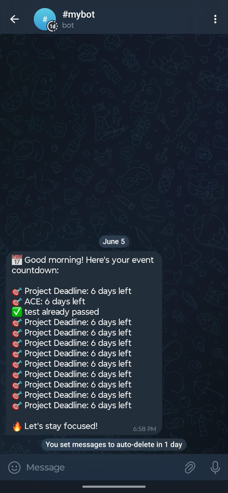

# ⏳ Countdown Events App

A clean, customizable, and real-time countdown timer web app — perfect for tracking personal events, launches, or important milestones.

> 🚀 **Live Demo**: [Click here to try it out](https://r-polisetti.github.io/MCA/)

---

## ✨ Features

- ✅ **Multiple countdowns** with title, description, and custom start dates
- 🌗 **Dark mode toggle** (remembers your preference)
- 📆 **Live countdowns** showing days, hours, minutes, seconds
- 📊 **Animated progress bar** showing event progress
- 🎨 **Color-coded cards**:
  - 🟢 Green – Plenty of time left
  - 🟡 Yellow – Halfway there
  - 🔴 Red – Approaching fast!
- 🔁 **Auto-updates every second**
- 💬 **Rotating motivational quotes**
- 📩 **Telegram notifications** (optional feature via GitHub Actions)
- 💾 **Deployed via GitHub Pages** — no backend required

---

## 🖼️ Screenshots

  
 

---

## 📁 Project Structure

```plaintext
modc.github.io/
├── index.html          # Main app logic + UI
├── events.json         # Your event data
├── send_notification.py # Telegram notifier script (optional)
├── .github/workflows/
│   └── notify.yml      # GitHub Action for daily Telegram messages
├── preview.png         # (Optional) App preview image
└── README.md
```
---

## 📅 How to Add or Update Events
Open events.json

Add events in this format:

```json
[
  {
    "name": "Project Launch",
    "description": "Final release of the platform",
    "date": "2025-06-20T00:00:00",
    "startDate": "2025-06-01T00:00:00"
  }
]
```
Date must be in full ISO format (e.g. YYYY-MM-DDTHH:mm:ss)
startDate is optional — if not given, current time is used.

---

## 🛠️ How to Run Locally
You can test the app on your own machine before pushing it:

```bash
# Start a local web server (Python 3)
python -m http.server
```
Then open: http://localhost:8000 in your browser
Or use Live Server in VS Code.

---

## 🌐 Deploying on GitHub Pages
Push your files to a GitHub repo (e.g. modc.github.io)

Go to Repo Settings > Pages

Set source as / (root) or main branch, and folder as /root

Done! Your site will be live at:

```php-template
https://<your-username>.github.io/<repo-name>
```
---

##🔔 Optional: Daily Telegram Notifications
Want daily reminders sent to Telegram?

Add your events to events.json

Set up secrets TELEGRAM_BOT_TOKEN and TELEGRAM_CHAT_ID

GitHub Actions will send a summary every morning 🎯

See send_notification.py and .github/workflows/notify.yml

---

##📒 Changelog [v1.0] – 2025-06-04

Initial version launched

* Countdown with color-coded status
* Live dark mode, quotes, progress bar
* GitHub Actions + Telegram notifications

---

## 🧠 Credits & Inspiration
Built with 💙 using vanilla HTML, CSS, and JavaScript

Motivated by the need to track deadlines & goals in a beautiful way

UI inspired by minimalist productivity apps

---

## 📃 License
This project is open-source under the MIT License.

---

## Made with ❤️ by r-polisetti
